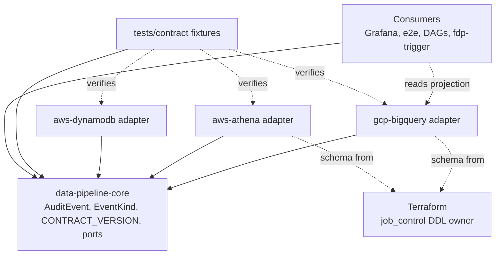
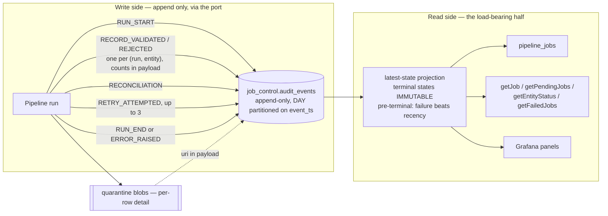

# Architecture Spine — Culvert job_control / audit surface

> **Revision note (2026-09-04).** This is the post-gate revision. Four reviewer
> lenses found that the first draft specified the event log in detail and the
> **projection** almost not at all — and that AD-2 and AD-3, each defensible
> alone, combined into a **data-loss path**. Three of the author's own ADs were
> factually wrong. Every finding below was independently verified against the
> code before being accepted. See `reviews/`.

## Design Paradigm

**Event sourcing with a latest-state projection**, behind Culvert's existing
**ports-and-adapters** contracts. The port surface keeps its shape; the store
becomes an append-only event log, and every "current state" question is answered
by a projection over it.

The decisive observation: `docs/CONTRACT.md:92` §4's `event_kind` enum —
`RUN_START`, `RUN_END`, `RECORD_VALIDATED`, `RECORD_REJECTED`, `RECONCILIATION`,
`ERROR_RAISED`, `RETRY_ATTEMPTED` — **is the job-control lifecycle under another
name**. Job control and the audit trail were never two things; they were one
thing modelled twice, which is how four incompatible shapes for one table name
came to exist.

**The projection is the load-bearing half.** Every integrity risk the gate found
lives on the read side, not the write side. Treat an under-specified projection
as a defect, not a detail.

| Layer | Where |
| --- | --- |
| Event type + contract constant | `data-pipeline-core` / `data_pipeline_core` |
| Ports (`JobControlRepository`, `AuditEventPublisher`) | `…core.contracts` |
| Append + projection adapters | `…gcp-bigquery`, `…aws-athena`, `…aws-dynamodb` |
| Schema ownership | `infrastructure/terraform/systems/generic/main.tf` |
| Consumers | Grafana configmap, e2e scripts, Airflow DAGs, `fdp-trigger` |

## Invariants & Rules

### AD-1 — `job_control.audit_events` is the job-control log

- **Binds:** every job-control write path; both emitters; the DDL; every run-status consumer
- **Prevents:** a shadow job-control model outside the contract — the mechanism that produced four incompatible shapes
- **Rule:** `JobControlRepository` writes are appends to `job_control.audit_events`. `pipeline_jobs` becomes a **derived, read-only latest-state projection**. *(Stated as semantics, not mechanism: a SQL `VIEW` is the BigQuery/Athena realisation, but AD-13 also binds DynamoDB, where a view does not exist. AD-12 enforces the behaviour; the mechanism is the adapter's business.)*

### AD-2 — The store is append-only

- **Binds:** all three `JobControlRepository` implementations
- **Prevents:** last-write-wins overwriting a recorded failure; a store only `UPDATE`-capable backends can implement
- **Rule:** No `UPDATE` or `DELETE` against `job_control.*` in any adapter. State changes are new rows.

### AD-3 — Terminal states are immutable; failure wins only *before* terminal

- **Binds:** the projection; `getJob`, `getPendingJobs`, `getEntityStatus`, `getFailedJobs`, `getFdpJobStatus`; `RetryOrchestrator`
- **Prevents:** **(a)** the data-loss path the gate found — see below; **(b)** the `event_ts` tie-break ambiguity, since precedence decides rather than recency; **(c)** review finding #1 recurring at the storage layer
- **Rule:**
  1. Once a run reaches a terminal state (`SUCCEEDED` or `FAILED`), later contradicting events are **recorded but do not change the projection**, and can never make the run retryable.
  2. Before terminal, failure beats success regardless of `event_ts`: an `ERROR_RAISED`, or a `RECONCILIATION` whose `payload.reconciled` is `false`, yields `FAILED`.
  3. A retry does **not** clear a failed run. Per `docs/CONTRACT.md:226` §7 a retried pipeline takes a **new `run_id`**, recording the old one in `payload.previous_run_id`. The failed run stays failed forever; the new run is a new row.

> **Why rule 1 exists.** Verified chain: `BigQueryJobControlRepository.java:613-617`
> currently requires prior state `RUNNING` for `SUCCEEDED` — that compare-and-set
> is what blocks a late event flipping a finished run. AD-2 removes CAS. Without
> rule 1, AD-3 then lets a late first `ERROR_RAISED` make a *successful* run read
> `FAILED`; `FAILED` is retryable (`:618-621`), so `RetryOrchestrator.java:111`
> calls `cleanupPartialLoad`, which is `DELETE FROM <targetTable> WHERE _run_id`
> (`:541`) — **deleting the data the successful run just loaded.** Neither AD was
> wrong alone.

### AD-4 — Event identity is `(run_id, entity, event_kind)`; volume is O(1) per run-entity

- **Binds:** every emitter; `getEntityStatus`
- **Prevents:** **(a)** a literal reading of §4 emitting one row per input row (~5,000,003 rows for a 5M-row extract, duplicating quarantine); **(b)** `getEntityStatus` being unimplementable — it returns a `List<EntityStatus>` per system+date (`JobControlRepository.java:58`) and cannot be derived from per-run aggregates
- **Rule:** `RECORD_VALIDATED` and `RECORD_REJECTED` are emitted **once per `(run_id, entity)`** with counts in `payload`. Per-row detail stays in quarantine blobs; `RECORD_REJECTED.payload.quarantine_uri` points at it. The `entity` column is REQUIRED on every event.

### AD-5 — Append failures are split by event class, and are never silent

- **Binds:** both emitters; every `catch` around an append
- **Prevents:** the swallow at `BigQueryAuditEventPublisher.java:238-243` surviving the rebuild; and coupling ingestion availability to BigQuery for a counter nobody reads in an incident
- **Rule:** The seven `event_kind` values partition exactly two ways, with none left unclassified:
  - **Run-level — a failed append THROWS:** `RUN_START`, `RUN_END`, `ERROR_RAISED`, `RECONCILIATION`, `RETRY_ATTEMPTED`.
  - **Aggregate — a failed append logs ERROR, dead-letters, continues:** `RECORD_VALIDATED`, `RECORD_REJECTED`.
  - **No append may be swallowed under any circumstance.**

### AD-6 — Duplicate suppression is by event semantics, not by a synthetic key

- **Binds:** `createJob`, every retry path, all three adapters
- **Prevents:** **(a)** collapsing events the contract *requires* to repeat; **(b)** an invariant unimplementable on the backends AD-13 binds
- **Rule:** There is **no** `(run_id, event_kind)` uniqueness constraint. Duplicate lifecycle events are tolerated and resolved by AD-3's precedence, because:
  - `docs/CONTRACT.md:252` §9 mandates emitting `RETRY_ATTEMPTED` **before each retry, capped at 3** — so up to three legitimately share one `run_id`.
  - `RECONCILIATION` can legitimately occur more than once per run.
  - Non-Iceberg Athena has no conditional insert, no unique constraint and no transaction, so an atomic upsert is not implementable there.

  *(This corrects a first-draft AD that contradicted the contract it was implementing.)*

### AD-7 — `contract_version` comes from one constant per language

- **Binds:** every emitter in both languages
- **Prevents:** per-adapter drift, and an adapter forgetting to stamp it
- **Rule:** One constant in the core package, stamped by the **event constructor**, never per-emitter and never duplicated per adapter. Satisfies Story 1.4 AC1.

### AD-8 — `AuditEvent` replaces `AuditRecord` outright — [ADOPTED]

- **Binds:** `AuditRecord.java`, `records.py`, both emitters, every test double
- **Prevents:** two audit shapes live at once — which a dual-write window would have reintroduced
- **Rule:** Clean break at 0.2.0. No dual-write, no shim, no parallel types. 0.1.x stays published and frozen. *(Settled by: no external consumers exist.)*

### AD-9 — One owner for the `job_control` DDL, and the schema must actually change

- **Binds:** `main.tf`; `03_create_infrastructure.sh`; `setup_cdp_segment_infra.sh:108`
- **Prevents:** a fifth shape, **and** a green-plan no-op that looks like success
- **Rule:**
  1. Terraform is authoritative for `job_control` table schemas; the shell scripts stop declaring them. The genuinely divergent pair is **`pipeline_jobs`** — `main.tf:597-644` (23 columns) vs `03_create_infrastructure.sh:147-175` (16). *(The two `audit_trail` declarations are in fact identical; the first draft cited the wrong table.)*
  2. **`lifecycle { ignore_changes = [schema] }` must be removed from both `job_control` tables before any schema work.** It is set on `pipeline_jobs` and `audit_trail` today, so AD-9 and AD-15 would otherwise plan green and change nothing — a silent no-op, in the very tool this epic uses to fix silent failures.
  3. Verification is that the schema **changed**, never that `terraform apply` exited 0.

### AD-10 — Names follow the contract, not the DDL

- **Binds:** the DDL, emitter defaults, dashboards, e2e scripts
- **Prevents:** the `audit_events` / `audit_trail` collision persisting
- **Rule:** The target is `job_control.audit_events` (`docs/CONTRACT.md:92`). `audit_trail` is renamed; the emitter default of `<project>.audit.audit_events` is corrected. Resolves Story 1.6's wrong-dataset/wrong-table half.

### AD-11 — The conformance suite is the cross-language parity guard

- **Binds:** both language test suites; the contract change process
- **Prevents:** review finding #13 — contracts claiming "Java mirror of the Python Protocol" with nothing enforcing it; and `docs/CONTRACT.md:289-296` being unexecutable because it requires fixtures that do not exist
- **Rule:** §10.6's `tests/contract/` is **built**, with fixtures read by both languages. A missing counterpart **fails**, never skips. Parity is asserted as **semantic equality after JSON parse**, not column-level byte equality — `payload` has no Athena JSON type (Hive has none; `AthenaWarehouse.java:401-418` falls through to `varchar`).

### AD-12 — Append-only and terminal-immutability are asserted behaviourally

- **Binds:** every `JobControlRepository` implementation
- **Prevents:** a backend satisfying the letter of append-only while its reads still return last-write-wins
- **Rule:** The contract test appends failure-then-success and asserts `FAILED`; **and** appends success-then-late-failure and asserts the run stays `SUCCEEDED` and non-retryable (AD-3 rule 1). Any backend that passes is implementable without `UPDATE`.

### AD-13 — No adapter is left mutating

- **Binds:** BigQuery, DynamoDB, Athena
- **Prevents:** a shipped adapter deliberately violating a contract just made append-only
- **Rule:** All three pass AD-12. Athena is **built**, not merely unblocked. *(Verified feasible: Athena supports `INSERT INTO` on non-Iceberg Hive tables — Iceberg is not required.)*

### AD-14 — Every writer comes inside the port; consumers move with the shape

- **Binds:** `fdp-trigger/src/fdp_trigger/job_control.py:29,:54`; `postgres-cdc-streaming/.../job_control.py`; `_job_control.py:60-61`; `grafana-dashboards-configmap.yaml`; e2e scripts
- **Prevents:** the shadow model AD-1 forbids — which **already exists in two places** — and shipping knowingly-broken consumers
- **Rule:**
  1. No code writes `job_control.*` except through `JobControlRepository`. The two existing bypass writers are brought inside the port or deleted. *(A streaming insert against a projection hard-fails, and `fdp-trigger`'s fires **after** `launch_segment_transform` has already committed — so this is a correctness fix, not tidying.)*
  2. Readers that implement their own recency logic — `_job_control.py:60-61`'s `QUALIFY ROW_NUMBER() … ORDER BY updated_at DESC` — are replaced by the projection, since recency is exactly what AD-3 forbids.
  3. Consumers of a changed table are updated in the same epic as the change.

### AD-15 — `audit_trail` is dropped and recreated; `pipeline_jobs` is migrated

- **Binds:** the cutover
- **Prevents:** applying a "nothing reads this" proof to a table that four things read
- **Rule:** The two halves are **not** alike:
  - **`audit_trail`** — dropped and recreated. Verified: `AuditRecord` has zero production call sites and the publisher defaulted to a dataset that was never provisioned, so no data exists to preserve.
  - **`pipeline_jobs`** — has a live in-repo writer, an external writer and four live readers. It is **migrated**, with its readers cut over first. It may **not** be dropped.

### AD-16 — The `payload` key contract is bound per `event_kind`

- **Binds:** every emitter and every reader, both languages, all three clouds
- **Prevents:** the single largest divergence surface in this design — `PipelineJob` is a 23-component record against §4's 10 columns, so ~19 fields live in `payload`, and §10.3 (`docs/CONTRACT.md:265`) forbids adding columns. Unbound, two adapters diverge on `markFailed` alone, and a key typo returns `NULL` **silently** where today's typed schema fails loudly
- **Rule:** Each `event_kind` has a documented, fixture-pinned set of required `payload` keys, versioned with the contract and asserted by AD-11's suite. A reader that finds a required key missing **raises**; it must never coerce to `NULL`.

### AD-17 — One status vocabulary

- **Binds:** `JobStatus`, the projection, every consumer that filters on status
- **Prevents:** vocabulary drift between writers and readers of run status. *(Corrected 2026-09-04 after implementation: the original finding claimed `fdp-trigger/dedup.py` matched zero rows and caused duplicate Dataflow launches. It does not — `fdp-trigger` wrote `RUNNING` and read `RUNNING`, so it was internally consistent. The real defect was that **no terminal status was ever written**, latching the gate closed and blocking every re-run. Fixed in `spec-fdp-trigger-dedup-terminal-status.md`. The case mismatch was real but latent, and this AD is what keeps it from becoming live.)*
- **Rule:** `JobStatus`'s lowercase wire values are the single vocabulary. §4 has no `status` column, so the projection derives it and its domain is exactly `JobStatus`. No consumer may invent a value.

### Dependency direction



Adapters depend on core; core depends on nothing. **Consumers depend on the port,
never on the table** — AD-14's rule 1 is what makes that arrow real rather than
aspirational.

## Consistency Conventions

| Concern | Convention |
| --- | --- |
| Naming | Contract names beat DDL names, always. `job_control.audit_events`, `job_control.finops_usage`. Event kinds are §4's enum verbatim, uppercase. Status values are `JobStatus`'s lowercase wire forms (AD-17). |
| Data & formats | `event_ts` UTC TIMESTAMP, partition column. `run_id` per §7 — **never reused across executions**; a retry mints a new one. `entity` REQUIRED on every event. `payload` JSON, keys bound per `event_kind` (AD-16). `contract_version` on every row. |
| State & cross-cutting | Append only (AD-2). Current state by projection with terminal immutability (AD-3). Run-level append failure throws; aggregate dead-letters; nothing is swallowed (AD-5). |
| Extension | A new event type is a new `event_kind` plus bound `payload` keys — never a new column, never a new table. |

## Stack

| Name | Version |
| --- | --- |
| Java | 17 (CI toolchain 21; JDK 25 builds green) |
| Python | ≥3.10 (`requires-python`); CI runs 3.11 |
| `google-cloud-*` via `libraries-bom` | 26.39.0 — **stale**, upstream is 26.86.0; bump is out of scope but noted |
| AWS SDK v2 (`aws.sdk.version`) | 2.25.31, **duplicated across six module poms** with no parent property; upstream is 2.54.x |
| Culvert `CONTRACT_VERSION` | 1.0.0 → bumped by the implementing PR per §2 |

## Structural Seed



```text
data-pipeline-libraries-java/
  data-pipeline-core-java/           # AuditEvent, EventKind, CONTRACT_VERSION, ports
  data-pipeline-gcp-bigquery-java/   # append + projection
  data-pipeline-aws-athena-java/     # append + projection   (NEW: job control)
  data-pipeline-aws-dynamodb-java/   # append + projection
  data-pipeline-contract-tests-java/ # AD-12 behavioural suite
data-pipeline-libraries/             # Python mirror — same ports, same fixtures
tests/contract/                      # NEW — §10.6 fixtures, read by BOTH languages
infrastructure/terraform/systems/generic/main.tf   # sole schema owner (AD-9)
deployments/fdp-trigger/             # bypass writer -> comes inside the port (AD-14)
deployments/postgres-cdc-streaming/  # second unregistered impl -> same
```

## Capability → Architecture Map

| Capability / Area | Lives in | Governed by |
| --- | --- | --- |
| Story 1.4 — `contract_version` + audit schema | core + all adapters | AD-1, AD-7, AD-8, AD-11, AD-16 |
| Story 1.6 — audit writes reach a real table | bigquery adapter + Terraform | AD-5, AD-9, AD-10 |
| Review #4/#12 — append-only job control | all three adapters + contract-tests | AD-2, AD-3, AD-12, AD-13 |
| Review #13 — Java/Python parity | `tests/contract/` | AD-11 |
| Review #1 — mismatch can never read green | the projection | AD-3 |
| Shadow writers (found by the gate) | `fdp-trigger`, `postgres-cdc-streaming` | AD-14 |
| Run-status vocabulary drift (found by the gate) | `fdp-trigger`, `JobStatus` | AD-17 |

## Deferred

- **§6 `job_control.reconciliation_record`.** No producer in either language, but **five Grafana panels query it** — so it cannot be deferred as "unused". Whether §4's `RECONCILIATION` event supersedes it is a contract decision, and it gates a live consumer rewrite.
- **§5 `finops_usage`.** Same treatment applies (AD-7, AD-9, AD-10, AD-11, AD-16), but its grain is per-operation and genuinely differs from §4's. **Six Grafana panels** select `usage_ts` where the contract says `event_ts`. Sequenced after §4, and not free.
- **`libraries-bom` and AWS SDK currency.** Both materially behind upstream. Out of scope here; worth its own ticket, and the AWS property should be hoisted to the parent pom while someone is in there.
- **Retention / partition expiry** on a log that now grows monotonically. Not urgent at one run per entity per day; revisit before any high-frequency source.
- **Emulator-tier verification.** Nothing in this surface has ever run against the BigQuery emulator. Required before the epic is called done — a verification gap, not an architectural one.
