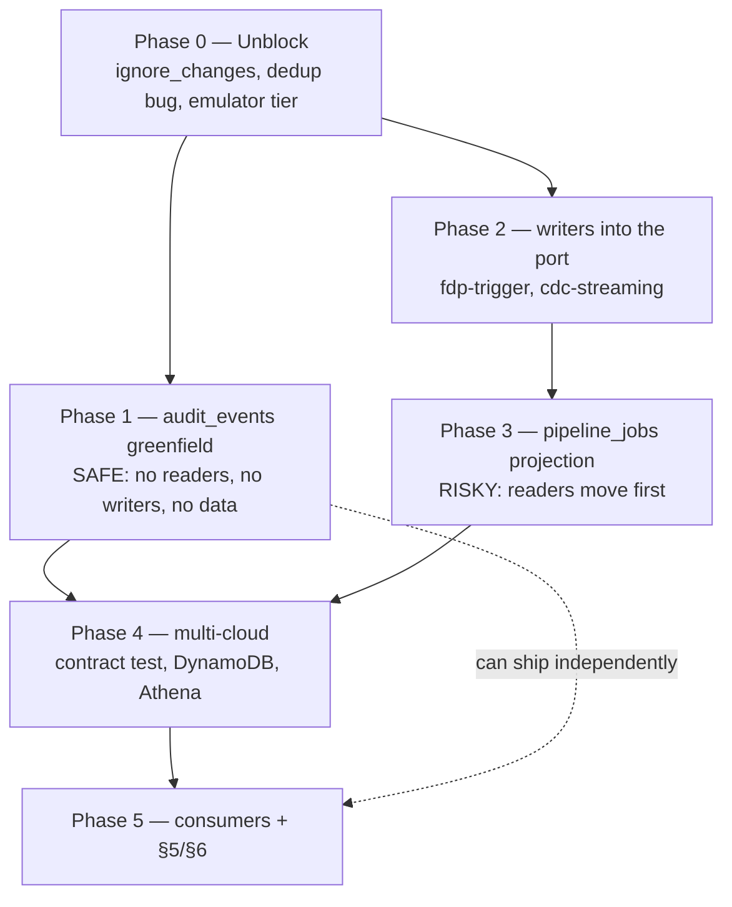

# Migration & sequencing — job_control / audit rebuild

**Companion to:** `ARCHITECTURE-SPINE.md` (same folder)
**Date:** 2026-09-04
**Status:** proposal for Joseph — the phase split below changes Epic 1's shape

---

## The headline: this is not one epic

Epic 1 was scoped as five defect stories. The reviewer gate showed the
job_control half is a **migration with live writers and readers**, not a defect
fix. The two halves have completely different risk profiles:

| | `audit_events` (Story 1.4 / 1.6) | `pipeline_jobs` (findings #4/#12) |
| --- | --- | --- |
| Live writers | 0 — publisher never worked | **3** at the gate — port + 2 bypass writers; **1** since Phase 2 (2026-09-08) |
| Live readers | 0 | **4** (+ Grafana panels) |
| Data to preserve | none | yes |
| Can drop & recreate? | **Yes** | **No** |
| Risk if wrong | a table nobody reads stays empty | duplicate Dataflow launches, deleted warehouse data |

**Recommendation: split.** `audit_events` is effectively greenfield and can land
fast. `pipeline_jobs` is a cutover that needs its readers moved first. Landing
them together means the safe half waits on the risky half, and one revert takes
out both.

---

## Phase 0 — Unblock, before any schema work

Three items that make everything downstream either possible or honest. None
depends on the spine's decisions.

| # | Work | Why first |
| --- | --- | --- |
| 0.1 | Remove `lifecycle { ignore_changes = [schema] }` from `pipeline_jobs` and `audit_trail` in `main.tf` | Every later phase's DDL change would otherwise **plan green and do nothing**. This is the single highest-value line in the plan. |
| 0.2 | ~~Fix the dedup status filter~~ **DONE 2026-09-04** — but the diagnosis was wrong. `fdp-trigger` wrote `RUNNING` and read `RUNNING`; nothing ever wrote a *terminal* status, so the gate latched closed and blocked every re-run, including retries after failure. The inverse of the reported fault. See `spec-fdp-trigger-dedup-terminal-status.md`. |
| 0.3 | Verify the emulator tier runs at all (`mvn -P it verify`) | Nothing in this surface has ever been exercised against an emulator. Building on an unverifiable tier is how the current four shapes survived. |

> Note: the segment-transform Flex Template **cannot launch at all today** —
> `launcher.py` sends snake_case parameters against camelCase Beam options and
> never sends the required `templatePath`. So no duplicate launches were ever
> occurring through this path. Recorded in `deferred-work.md`.

---

## Phase 1 — `audit_events` greenfield (safe, fast)

Nothing reads `audit_trail`; `AuditRecord` has zero production call sites; the
publisher pointed at a dataset that was never provisioned. So this half carries
no migration risk at all.

1. `AuditEvent` + `EventKind` + `CONTRACT_VERSION` in core, both languages (AD-7, AD-8).
2. `tests/contract/` fixtures — **built before the emitters**, so the emitters are written against a falsifiable target (AD-11, AD-16).
3. `payload` key contract per `event_kind`, fixture-pinned (AD-16).
4. Terraform: `audit_trail` → `audit_events`, contract shape (AD-9, AD-10).
5. `BigQueryAuditEventPublisher` rewritten: correct dataset/table, throws on run-level failure, dead-letters aggregates (AD-5). **Closes Story 1.6.**
6. Python emitter to match; `PubSubAuditPublisher` stops using `dataclasses.asdict`.

**Exit test:** a run emits its events, a deliberately-broken run-level append
*fails the pipeline*, and the conformance fixtures pass from both languages.

---

## Phase 2 — Writers come inside the port

Must precede Phase 3: converting `pipeline_jobs` to a projection while a
streaming insert still targets it produces a **hard failure after
`launch_segment_transform` has already committed**.

1. ~~`fdp-trigger/job_control.py` → `JobControlRepository`~~ **DONE 2026-09-08.** The Python side had no implementation of the port at all, which is *why* both writers hand-rolled SQL. `data_pipeline_gcp_bigquery.BigQueryJobControlRepository` is now that implementation — write path only (`create_job`, `update_status`, `mark_failed`), registered under the `job_control` entry-point slot. `record_trigger` builds a `PipelineJob` and calls it.
2. ~~`postgres-cdc-streaming/.../job_control.py` → the port, or deleted if redundant.~~ **DONE 2026-09-08** — deleted; the runner imports the library adapter. It was redundant with the class it became.
3. ~~`_job_control.py:60-61`~~ **DONE 2026-09-08.** Recency-wins is replaced by terminal-state precedence: `failed` outranks everything, `succeeded` outranks every non-terminal state, and `updated_at DESC` survives only as the tie-break among undecided rows. **Operational consequence:** a retry that succeeds no longer clears a failed entity for the dependency checker (AD-3 rule 3 — the failed run stays failed). Intended, but it is a live change to when downstream FDP/CDP transforms fire.
   *Note:* the file is `data-pipeline-libraries/data-pipeline-orchestration/.../_job_control.py` — a published library, not a deployment.

**Exit test:** `grep` finds no write to `job_control.*` outside the port. Passing as of 2026-09-08: `grep -rnE "INSERT INTO|MERGE INTO|UPDATE \`|DELETE FROM" --include="*.py"` matches only `data_pipeline_gcp_bigquery/job_control.py`.

**Still outstanding for Phase 2:** the full port surface is Java-only. The Python adapter covers the three write methods its callers use; the reads stay in `_job_control.py` until Phase 3 makes them a projection, rather than being duplicated now.

---

## Phase 3 — `pipeline_jobs` becomes a projection (the risky cutover)

Readers move **before** the table does.

1. Add the projection alongside the existing table — both live, no cutover yet.
2. Point each of the four readers at the projection, one at a time, verifying each.
3. Only then stop writing the physical `pipeline_jobs` rows.
4. Terminal-immutability (AD-3 rule 1) lands **with** this phase, never after.

> **AD-3 rule 1 is not optional and not a later hardening.** Without it, the
> moment `pipeline_jobs` loses compare-and-set a late `ERROR_RAISED` can flip a
> succeeded run to failed, and `RetryOrchestrator` will `DELETE` that run's
> warehouse rows. Append-only without terminal-immutability is *worse* than the
> mutable store it replaces.

---

## Phase 4 — Multi-cloud

1. `JobControlRepository` contract test asserting append-only **behaviourally** (AD-12).
2. BigQuery passes it.
3. DynamoDB rebuilt append-only — it currently mutates and would otherwise violate a contract just made append-only.
4. `AthenaJobControlRepository` built (AD-13). *Verified feasible: Athena supports `INSERT INTO` on non-Iceberg Hive tables; Iceberg is not required.*

---

## Phase 5 — Consumers and the deferred contract sections

1. Grafana ported to the event model (AD-14 rule 3).
2. **§6 `reconciliation_record`** — five panels query it. Decide whether §4's `RECONCILIATION` supersedes it. A contract decision, not a build one.
3. **§5 `finops_usage`** — six panels select `usage_ts` where the contract says `event_ts`. Per-operation grain, genuinely different from §4.

---

## What could still bite

| Risk | Mitigation |
| --- | --- |
| `terraform apply` exits 0 and changes nothing | Phase 0.1, and verify the **schema changed**, never the exit code (AD-9 rule 3) |
| A `payload` key typo returns `NULL` instead of failing | AD-16: readers raise on a missing required key; fixtures pin the keys |
| Adapters diverge on `payload` shape | Fixtures are shared across languages and clouds (AD-11) |
| `contract_version` bump has no correct SemVer bucket | §2 has no bucket for a per-row → per-run *semantic* change. Flag to Joseph; likely major, and §11's process needs the fixtures Phase 1 builds |
| Emulator tier still unrunnable | Phase 0.3 gates the rest |

---

## Sequencing at a glance

Phases 1 and 2 are independent and can run in parallel. Phase 3 is the only one
that can lose data, and it is gated on Phase 2 completing.
