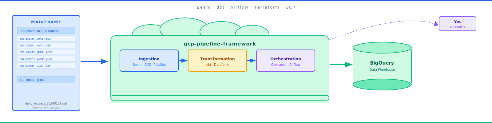
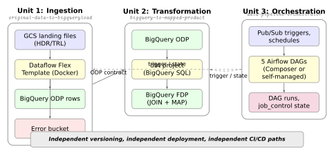

# I Built a Full GCP Data Pipeline Framework. Here's the Code — and What I Learned.

### After rebuilding the same mainframe-to-BigQuery pipeline for the third time, I got annoyed and wrote a framework. This is the tour.



---

Here's how I got here.

For years I've been building data pipelines on Google Cloud for banks, insurers, and big enterprises. Every project starts the same way: someone puts "mainframe → BigQuery" on a whiteboard, says "this should take a sprint," and then three months later we're drowning in audit logs, arguing about retry policies, and explaining to finance why the bill is three times what we quoted.

After the third rebuild, I stopped. I sat down. I wrote a proper framework.

It's called `gcp-pipeline-framework`. It's on PyPI. The reference repo is called `gcp-pipeline-reference`. This post is the high-level tour. Future posts in this series go deeper into each part.

---

## What it actually is

A production-grade, opinionated toolkit for moving mainframe data into BigQuery on GCP — with every boring-but-critical bit pre-solved.

In six Python packages:

- **`gcp-pipeline-core`** — the foundation. No Beam, no Airflow imports. Just audit trails, cost tracking, schema types, error classification, safe deletion, quality scoring. You can drop it into *any* runtime — Dataflow worker, Cloud Function, random script.
- **`gcp-pipeline-beam`** — Apache Beam transforms for the mainframe world: HDR/TRL parsing, split-file reassembly, schema-driven validation, error quarantine.
- **`gcp-pipeline-orchestration`** — Airflow operators, sensors, a DAG factory, and a dependency helper so the transform waits for the right upstream loads.
- **`gcp-pipeline-transform`** — dbt macros for audit columns and PII masking.
- **`gcp-pipeline-tester`** — base classes, fake clients, and fixture factories that make writing tests actually pleasant.
- **`gcp-pipeline-framework`** — the umbrella. `pip install` this one to get everything.

Plus three reference deployments (ingestion, transformation, orchestration), four more "here's how this pattern works" deployments, a full Terraform module set, and a CI/CD suite in GitHub Actions.

Oh, and the entire reference repo — docs, Terraform, CI configs, the lot — is publishable to PyPI. A small script called `reconstruct.py` rebuilds the whole project from the packages. Useful when your employer's VPC can't see GitHub but can see an internal Nexus.

---

## Why I bothered

Because the GCP ecosystem has the services, but not the opinions.

If you walk up to a GCP sales rep and ask "can I build a data pipeline?" the answer is yes. Cloud Storage. Pub/Sub. Dataflow. BigQuery. Composer. Cloud Functions. Datastream. They'll list ten of them.

What they won't tell you is that none of those services form a framework. They're Lego bricks. You still have to design your own audit format, write your own retry logic, invent your own schema validator, build your own cost tracker, and stitch together the ten lines of bash that turn Python code into a Dataflow Flex Template.

Every team I've worked with has written some version of that glue. None of those versions has been very good.

There's a gap. This is my attempt to fill it.

---

## The mental model, in one picture



Every pipeline I ship now has three deployment units:

- **Ingestion** takes a file and lands it in the ODP (Original Data Product) layer of BigQuery, untransformed.
- **Transformation** takes the ODP and builds the FDP (Foundation Data Product) — the business layer. dbt. Two flavours: JOIN (multiple sources) and MAP (one-to-one).
- **Orchestration** decides when each of the above runs, in what order, and what to do when things break. Airflow on Composer, or cheaper alternatives if you don't need all of it.

Each unit is deployed separately. Each has its own tests. Each has its own CI path filter. Teams can own different units without stepping on each other. An SQL change in the transform doesn't force an ingestion redeploy.

That single decision — "three units, not one pipeline" — is the one I'd give you if I could only give you one.

---

## The bits the framework gives you that you'd otherwise write yourself

Quick list. I'll deep-dive each of these in later posts:

- **Schema as single source of truth.** One `EntitySchema` drives ingestion, validation, BQ table creation, PII masking, tests, and fixtures. Change it once; everything else follows.
- **HDR/TRL parser.** Mainframe files come with headers and trailers. Beam doesn't understand them natively. Mine does.
- **Run ID propagation.** One identifier threads every log, metric, audit event, Dataflow job, dbt invocation, and cost record. Tracing a failure end-to-end becomes a single filter.
- **Error classification.** Validation errors don't retry. Integration errors do, with exponential backoff and jitter. Resource errors fail loudly.
- **First-class cost tracking.** Every BigQuery query, GCS op, and Pub/Sub publish is recorded with cost and labels. You can answer "which entity cost me the most this week?" with a two-line SQL query.
- **Reconciliation engine.** HDR/TRL counts = valid + invalid = BigQuery row count. Any mismatch is an alert and a failed run.
- **Safe deletion.** REVIEW → HOLD → DELETE → ARCHIVE. No one-command `DELETE FROM`. Auditors love this.
- **DAG factory.** Ten entities? One YAML file. No hand-maintained DAGs.
- **PyPI as artefact registry.** Everything published. `reconstruct.py` to rebuild the repo from packages.

---

## What it costs to run

I deploy the reference `generic` system for about **$185 a month** without Composer — covers four entities, daily loads, about five million rows per entity. With Composer the bill jumps to roughly **$485/month**, which is why Composer is opt-in by default. If you don't need Airflow, substitute Cloud Functions + Cloud Run Jobs and save $300.

I've put a detailed cost model in the book. The headline: ingestion and BigQuery are cheap. Composer is where the money goes.

---

## What I got right, what I didn't

The framework is solid. It's also not perfect. Things I got right:

- Framework-agnostic core. No Beam or Airflow imports in the foundation.
- Three-unit deployment model.
- `run_id` everywhere.
- FinOps baked in from day one.
- 763 unit tests across the libraries.
- Path-filtered CI so a docs change doesn't redeploy prod.

Things I'd fix in v2:

- No automated end-to-end test in CI yet. Still a manual script.
- No canary deploy pattern. A bad Dataflow image goes straight to prod.
- The streaming reference (Postgres CDC) is a skeleton, not a working pipeline.
- No admin UI for quarantine review. It's all Slack + SQL.

I'm writing a full honest-code-review chapter in the book. I'd rather you know the warts than buy a shiny sales pitch.

---

## Where this series goes

This is post 1 of 8. Coming up:

1. **The GCP pipeline gap** — why your team keeps rebuilding the same thing.
2. **GCP data pipelines, zero to hero** — the basics of GCS, Pub/Sub, BigQuery, Dataflow, Composer in one post.
3. **The three-unit deployment model** — the architecture in depth.
4. **Mainframe to BigQuery** — HDR/TRL parsing with Beam.
5. **JOIN vs MAP** — the two transformation patterns every data engineer should know.
6. **When to skip Cloud Composer** — orchestration without the $300/month overhead.
7. **Shipping a Python framework to PyPI** — lessons from `gcp-pipeline-framework`.

Follow along if you're building anything like this — or if you just want to nerd out about audit trails.

---

## Try it

```bash
pip install gcp-pipeline-framework
python -m gcp_pipeline_framework.reconstruct --dest ~/my-pipeline
cd ~/my-pipeline
```

That's a full working project layout on your disk. Deploy instructions in the README. If you hit a rough edge, tell me — I'll fix it.

If you want the full story in one go, the book version (with honest code review, cost model, and a zero-to-hero chapter) is [over here on Gumroad/Google Play — add link before publishing].

---

*Thanks for reading. If this was useful, a clap helps more than you'd think. Questions and feedback welcome in the comments — I read every one.*

---

### About the author

**Joseph Aruja** — Lead Software Engineer based in Leeds, UK. Twenty-five years across banking, government, retail, transport, healthcare, and travel — including NHS Spine (technical lead, Release 7A), HSBC / First Direct / M&S Bank, GOV.UK / Home Office / DWP, Jaguar Land Rover, Booking.com, Smart Ticketing on Manchester Metrolink, and Wm Morrison's Evolve mainframe-integration programme. Member of the JSR 255 (JMX) Java Community Process specification group. Currently Senior Lead Engineer on a financial-services mainframe-to-cloud migration.

Connect on [LinkedIn](https://www.linkedin.com/in/josepharuja/) · email joseph.a.aruja@gmail.com

**Want the long form?** This series is part of a book — *Building Production-Grade Data Pipelines on Google Cloud* — available at [link — add before publishing]. **If this post was useful, a clap helps more than you'd think, and follow for the next instalment.**
