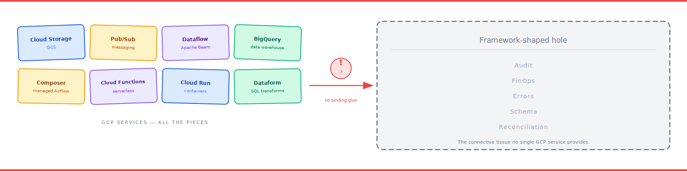

# The GCP Data Pipeline Gap: Why Your Team Keeps Rebuilding the Same Thing Badly

### Google has every service you need. They just don't come with an instruction sheet.



---

If you've ever built a data pipeline on Google Cloud, you've had this experience.

You draw the architecture on a whiteboard. Cloud Storage in, BigQuery out. Dataflow in the middle. Pub/Sub for triggers. Composer if you need orchestration. Looks easy.

Three months later you're in a retro, surrounded by colleagues who look as tired as you do, and somebody asks: "why did this take three months?"

The honest answer is: you didn't build a pipeline. You built a *framework*. You just didn't call it that. And every team before yours built one too. And every team after yours will build one again. All of them different, all of them incomplete, all of them held together with bash scripts and hope.

Let me tell you why.

---

## Google has the services. It doesn't have the opinions.

Google Cloud's pitch is, genuinely, excellent. Every service you need exists, scales, integrates with the billing system, has an SDK in your language.

- **Cloud Storage** for landing files.
- **Pub/Sub** for events.
- **Dataflow** for distributed processing.
- **BigQuery** for the warehouse.
- **Composer** for Airflow.
- **Cloud Functions** for lightweight glue.
- **Datastream** for CDC.
- **Data Fusion** for low-code ETL.
- **Dataplex** for governance.

It's all there. They're first-rate services. They bill you by the second.

What they don't give you is a *framework*. There's no instruction sheet that says "if you want to build a regulator-friendly mainframe-to-BigQuery pipeline that survives the next on-call rotation, here's the recipe."

You get Lego bricks. You have to be the architect.

---

## What nobody tells you at the start

Here's the list of things every team building a serious GCP data pipeline rebuilds from scratch. I've counted them off on my fingers so many times I'm surprised there aren't callouses.

**1. A mainframe-aware ingestion library.**
Apache Beam doesn't understand HDR/TRL envelopes. No open library does. Every team writes a parser. Every parser has different bugs.

**2. A schema-driven validator.**
You either invent one that reads from a central definition, or you end up with `if pd.isna(x)` sprinkled across twenty files. Guess which option most teams pick.

**3. A cost-tracking layer.**
GCP billing tells you what last month cost. It can't tell you which entity, which run, which query. Unless you build it yourself. Most teams don't. They fly blind.

**4. A run-correlated audit trail.**
Cloud Logging has logs. Monitoring has metrics. BigQuery has query history. Dataflow has job IDs. None of them share an identifier. To trace a failure you need a `run_id` threaded through everything. That's a deliberate engineering choice someone has to make.

**5. An error-classification taxonomy.**
A malformed row needs quarantine, not retry. A BigQuery 500 needs retry, not quarantine. An out-of-memory needs a page, not a shrug. Generic retry libraries treat them all the same and make your on-call life worse.

**6. A data-deletion workflow.**
In regulated industries, `DELETE FROM` is basically illegal. You need approvers, holds, tombstones, and recoverable archives. Nobody ships this.

**7. A reconciliation engine.**
Did the envelope count match the ingested count match the BigQuery row count? Until you know, you're guessing. Most teams skip this and find out six months later when an auditor points it out.

**8. A coordination layer for JOIN preconditions.**
"Run the transform when both source loads are done" sounds simple. In practice every team writes a slightly broken version with sleep loops and eventual race conditions.

That's eight gaps. Every serious GCP pipeline team I've worked with has rebuilt at least five of them. Badly. Under time pressure. With no documentation.

---

## Why the open-source world hasn't fixed this

A reasonable question: if the gap is so obvious, why hasn't somebody published a framework that closes it?

Three reasons I keep coming back to.

**Mainframes aren't glamorous.**
Open-source contributors prefer streaming Kafka to Snowflake over EBCDIC-encoded fixed-width files from a 40-year-old Z/OS system. The need is huge; the contributor base is tiny.

**Enterprise frameworks are written under NDA.**
The teams who do solve this build it on company time, with company data, behind company firewalls. Their code never escapes the VPC.

**Opinions are unfashionable.**
Modern open source prefers "minimal toolkit, infinite extensibility." A framework that says "thou shalt use HDR/TRL, thou shalt have a `run_id`, thou shalt route rejects to a quarantine bucket" feels prescriptive. But pipelines need prescription. Without it you don't have a pipeline — you have a box of parts.

---

## What I did about it

I got tired of watching teams relearn the same lessons. So I built `gcp-pipeline-framework`.

It's opinionated where opinions matter and flexible where flexibility matters.

Opinionated:
- HDR/TRL is the default envelope. You can opt out.
- `EntitySchema` is the one true description of a table.
- `run_id` propagates everywhere.
- Errors are classified into validation / integration / resource.
- Cost is a metric, not a billing dashboard.
- Deletion is a workflow, not a statement.
- Reconciliation is mandatory.
- JOIN preconditions are explicit.

Flexible:
- Run on Composer, or skip it.
- On-demand BigQuery or flat-rate slots.
- OpenTelemetry or nothing.
- Public PyPI or internal Nexus.
- Add your own validators, transforms, DAG types.

It ships as six Python packages on PyPI. The whole reference repo — Terraform, CI, docs, the lot — rebuilds from packages with one Python script. About 763 unit tests. Path-filtered CI. Opt-in Composer to keep costs sane.

I'm not claiming it's *the* answer. There's no single answer. But it's *an* answer, and it's better than the box of Lego.

---

## If you're about to build one yourself

A few things I'd tell you before you start:

1. **Don't build one pipeline. Build three units.** Ingestion, transformation, orchestration. Independent lifecycles. Independent tests. Independent deploys.
2. **Make schema your source of truth.** One place. Drive everything from it.
3. **Thread a `run_id` through every log, metric, and row.** Day one. Retrofitting this is brutal.
4. **Track cost next to latency.** It's not a separate concern.
5. **Classify errors early.** The taxonomy is load-bearing.
6. **Reconcile, or you're guessing.**
7. **Composer is expensive.** Start without it.
8. **Publish your reusable parts as packages.** Even if you're the only consumer today.

Or just use mine. Either works.

---

## What's next in this series

This is post 2 of 8. Next up: **GCP data pipelines, zero to hero** — the basics of every service we've mentioned here in one readable post, with no prior knowledge assumed.

If you want to jump ahead to the code:

```bash
pip install gcp-pipeline-framework
python -m gcp_pipeline_framework.reconstruct --dest ~/my-pipeline
```

The full book is at [link — add before publishing].

---

*If you've rebuilt any of these eight gaps yourself, I'd love to hear which ones and what broke. Drop it in the comments.*

---

### About the author

**Joseph Aruja** — Lead Software Engineer based in Leeds, UK. Twenty-five years across banking, government, retail, transport, healthcare, and travel — including NHS Spine (technical lead, Release 7A), HSBC / First Direct / M&S Bank, GOV.UK / Home Office / DWP, Jaguar Land Rover, Booking.com, Smart Ticketing on Manchester Metrolink, and Wm Morrison's Evolve mainframe-integration programme. Member of the JSR 255 (JMX) Java Community Process specification group. Currently Senior Lead Engineer on a financial-services mainframe-to-cloud migration.

Connect on [LinkedIn](https://www.linkedin.com/in/josepharuja/) · email joseph.a.aruja@gmail.com

**Want the long form?** This series is part of a book — *Building Production-Grade Data Pipelines on Google Cloud* — available at [link — add before publishing]. **If this post was useful, a clap helps more than you'd think, and follow for the next instalment.**
