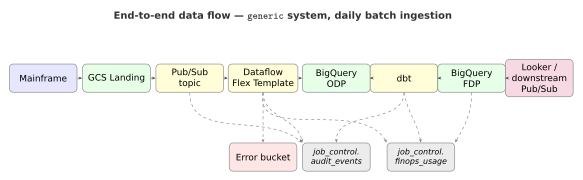

# GCP Data Pipelines, Zero to Hero

### Everything a beginner needs to know about the services that make up a modern GCP data pipeline — in one readable post.



---

I promised in my last post that we'd cover the basics of the GCP data stack before going any deeper. This is that post.

If you've never built a data pipeline on Google Cloud, you're in the right place. If you've built one but never felt like you really *got* why each service was there — also the right place.

By the end you'll have a mental map of the whole landscape. No prior knowledge assumed. Let's go.

---

## The mental model

A data pipeline, at its simplest, is four stages:

```
[ Source ] → [ Land ] → [ Process ] → [ Serve ]
```

- **Source** — where the data is born. A mainframe, a Postgres database, a Kafka topic, a SaaS export.
- **Land** — where it first arrives. Almost always Cloud Storage on GCP.
- **Process** — where you clean, validate, transform, and join it.
- **Serve** — where consumers reach in. BigQuery for analysts, Looker for dashboards, Pub/Sub for downstream systems.

Every GCP service you'll hear about sits in one of those four boxes. Once you see the boxes, the services stop being a confusing menu and start being a small set of choices per box.

---

## The services, in one paragraph each

I'll keep these tight. You don't need to memorise them — just know they exist and roughly what they do.

**Cloud Storage (GCS).**
Object storage. Buckets contain objects. Storage classes (Standard, Nearline, Coldline, Archive) trade cost against retrieval latency. Lifecycle rules move objects between classes automatically. GCS can publish notifications to Pub/Sub when an object lands — this is the #1 trigger for a pipeline.

**Pub/Sub.**
Managed publish/subscribe messaging. Publishers push to a topic; subscribers pull (or get pushed) from a subscription. At-least-once delivery by default. Think "Kafka, but simpler, less tunable, and almost always good enough."

**Dataflow.**
Managed runner for Apache Beam pipelines. You write Beam in Python or Java; Dataflow autoscales a worker fleet and runs your pipeline as batch or streaming. Beam's programming model is map/reduce/group with side inputs and outputs. Dataflow Flex Templates package a Beam pipeline as a Docker image you can launch with parameters.

**BigQuery.**
Serverless analytics warehouse. Columnar storage. Partitioned, clustered. On-demand pricing bills per byte scanned. Flat-rate pricing bills per slot-second. No cluster to manage — you cannot oversize or undersize it.

**Cloud Composer.**
Managed Apache Airflow on GKE. You write DAGs in Python; Composer schedules and runs them. Starts at ~$300/month before a single task runs. Use it when you need Airflow. Skip it when you don't.

**Cloud Functions.**
Single-purpose serverless functions. Trigger on HTTP, Pub/Sub, or GCS events. Charge per invocation. Great for small glue tasks.

**Cloud Run.**
Serverless containers. Stateless services or scheduled jobs. The cheapest place on GCP to run a daily dbt model.

**Dataform.**
Google's native SQL transformation tool, tightly integrated with BigQuery. dbt-bigquery is the more popular choice in 2026; Dataform is catching up.

**dbt (dbt-bigquery).**
The community-favourite SQL transformation framework. You write SQL; dbt materialises it as views, tables, or incremental tables; it runs tests, generates docs, and tracks lineage. Not a GCP service but everyone uses it.

**Datastream.**
Managed change-data-capture from Postgres, MySQL, Oracle, AlloyDB, SQL Server into GCS or BigQuery. The streaming on-ramp for "I have an OLTP DB I want analytics on."

**Cloud Logging.**
Structured log ingestion, indexing, querying. Every service writes here by default.

**Cloud Monitoring.**
Metrics, dashboards, alerts. Custom metrics are first-class. SLO tracking is built in.

**Cloud KMS.**
Customer-managed encryption keys. Use when Google-managed keys are not enough for your compliance team.

**Workload Identity Federation (WIF).**
Keyless authentication from external systems (GitHub Actions, AWS) into GCP service accounts. The right way to authenticate from CI in 2026.

That's it. Modulo a handful of specialised services, that's the whole substrate.

---

## The simplest possible pipeline, in 30 lines

To make all this concrete, here's the smallest pipeline that does something useful: read a CSV from GCS, count the rows, write the count to BigQuery.

```python
import apache_beam as beam
from apache_beam.options.pipeline_options import PipelineOptions

class CountToRow(beam.DoFn):
    def process(self, element):
        yield {"file_uri": "gs://example/in.csv", "row_count": element}

def run():
    options = PipelineOptions(
        runner="DataflowRunner",
        project="my-project",
        region="europe-west2",
        temp_location="gs://example/tmp",
        staging_location="gs://example/staging",
    )

    with beam.Pipeline(options=options) as p:
        (
            p
            | "Read"    >> beam.io.ReadFromText("gs://example/in.csv", skip_header_lines=1)
            | "ToOnes"  >> beam.Map(lambda _: 1)
            | "Sum"     >> beam.CombineGlobally(sum)
            | "ToRow"   >> beam.ParDo(CountToRow())
            | "WriteBQ" >> beam.io.WriteToBigQuery(
                "my-project:example.row_counts",
                schema="file_uri:STRING,row_count:INTEGER",
                write_disposition=beam.io.BigQueryDisposition.WRITE_APPEND,
                create_disposition=beam.io.BigQueryDisposition.CREATE_IF_NEEDED,
            )
        )

if __name__ == "__main__":
    run()
```

Runs. Works. Ship it, right?

Not quite. Let me count what's missing:

- No schema validation.
- No error handling.
- No audit trail.
- No cost tracking.
- No reconciliation.
- No `run_id`.
- No retries policy.
- No alerting.
- No PII masking.
- No tests.

Production pipelines have all ten of those things. Writing them from scratch every time is what kills teams. That's the gap `gcp-pipeline-framework` fills.

---

## A tiny Airflow DAG

Here's a minimal DAG that runs the above on a schedule:

```python
from airflow import DAG
from airflow.providers.google.cloud.operators.dataflow import DataflowCreatePythonJobOperator
from datetime import datetime

with DAG(
    dag_id="example_count",
    start_date=datetime(2026, 1, 1),
    schedule="@daily",
    catchup=False,
) as dag:
    DataflowCreatePythonJobOperator(
        task_id="count_rows",
        py_file="gs://example/code/count.py",
        job_name="example-count-{{ ds_nodash }}",
        location="europe-west2",
        options={"runner": "DataflowRunner"},
    )
```

Works. Missing: retries, SLAs, alerting, upstream dependency, audit, idempotence.

---

## A tiny dbt model

```sql
-- models/example/row_counts_daily.sql
{{ config(materialized='table') }}

SELECT
    DATE(load_ts) AS load_date,
    SUM(row_count) AS total_rows
FROM {{ source('example', 'row_counts') }}
GROUP BY 1
```

Missing: incremental materialisation, audit columns, PII masking, tests.

---

## A tiny Terraform module

```hcl
provider "google" {
  project = "my-project"
  region  = "europe-west2"
}

resource "google_storage_bucket" "landing" {
  name     = "example-landing"
  location = "EUROPE-WEST2"
  uniform_bucket_level_access = true
}

resource "google_pubsub_topic" "file_notifications" {
  name = "example-file-notifications"
}

resource "google_storage_notification" "trigger" {
  bucket         = google_storage_bucket.landing.name
  topic          = google_pubsub_topic.file_notifications.id
  payload_format = "JSON_API_V1"
  event_types    = ["OBJECT_FINALIZE"]
}
```

Works. Missing: lifecycle rules, encryption, IAM bindings, labels, dev/prod separation.

---

## The pattern you should see

Every one of the four snippets above is useful as a starting point and wrong in production. A real pipeline is the snippet plus ten surrounding concerns: validation, audit, cost, reconciliation, tests, alerts, IAM, encryption, lifecycle, lineage.

That's not complexity for complexity's sake. It's *load-bearing* complexity. Every layer exists because the simple version breaks once real data hits it.

So when you see a framework that looks dense and opinionated, ask: "what breaks if I take this layer out?" Most of the time, the answer is "nothing, until 3am next Tuesday."

---

## A glossary you'll thank yourself for

- **ODP** — Original Data Product. Untransformed BigQuery layer that mirrors source extracts.
- **FDP** — Foundation Data Product. Clean, business-shaped layer built from ODP.
- **CDP** — Consumable Data Product. Narrow, contracted views for downstream consumers.
- **JOIN pattern** — A transformation that combines multiple ODP sources into one FDP table.
- **MAP pattern** — A transformation that maps one ODP source to one FDP table.
- **Run ID** — A unique identifier per pipeline execution. Threaded through every log, metric, and row.
- **HDR/TRL** — Header/Trailer envelope on a mainframe extract file.
- **Reconciliation** — The check that envelope count = valid + invalid = BigQuery row count.
- **Quarantine** — Four-stage workflow (REVIEW → HOLD → DELETE → ARCHIVE) for rejects and deletions.

---

## What zero to hero looks like

By the end of this series you'll be able to:

- Look at an unfamiliar mainframe extract and design an ingestion pipeline for it in an afternoon.
- Add a new entity to a running framework deployment in a working day.
- Diagnose a failed run end-to-end using only the audit trail and `run_id`.
- Argue for or against Composer with actual cost numbers.
- Read a deployment workflow and tell what it really does.

That's hero.

---

## What's next

Next post in the series: **The three-unit deployment model** — the architectural decision that changed how I ship pipelines and why I'd give it to you if I could only give you one thing.

If you want to skip ahead:

```bash
pip install gcp-pipeline-framework
python -m gcp_pipeline_framework.reconstruct --dest ~/my-pipeline
```

Full book at [link — add before publishing].

---

*Found this useful? A clap is worth more than you'd think. Questions welcome in the comments — I read them.*

---

### About the author

**Joseph Aruja** — Lead Software Engineer based in Leeds, UK. Twenty-five years across banking, government, retail, transport, healthcare, and travel — including NHS Spine (technical lead, Release 7A), HSBC / First Direct / M&S Bank, GOV.UK / Home Office / DWP, Jaguar Land Rover, Booking.com, Smart Ticketing on Manchester Metrolink, and Wm Morrison's Evolve mainframe-integration programme. Member of the JSR 255 (JMX) Java Community Process specification group. Currently Senior Lead Engineer on a financial-services mainframe-to-cloud migration.

Connect on [LinkedIn](https://www.linkedin.com/in/josepharuja/) · email joseph.a.aruja@gmail.com

**Want the long form?** This series is part of a book — *Building Production-Grade Data Pipelines on Google Cloud* — available at [link — add before publishing]. **If this post was useful, a clap helps more than you'd think, and follow for the next instalment.**
