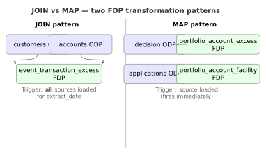

# JOIN vs MAP: The Two Transformation Patterns Every Data Engineer Should Know

### Every real pipeline needs both. Most frameworks pretend only one exists. Let's fix that.



---

Here's a question I ask in every data-engineering interview I run:

> "You have three source tables in your ODP and two target tables in your FDP. How does the transformation know when to run?"

The answer I'm looking for isn't "Airflow schedules it daily." It's the realisation that different FDP tables have different readiness conditions. Some need all their sources loaded before they can fire. Others can run the moment their single source lands.

That realisation, named explicitly, is the most useful bit of vocabulary I can give you: **JOIN pattern** and **MAP pattern**.

Most frameworks pretend only one exists. Most real pipelines need both.

---

## The MAP pattern

One source in. One target out. The transform fires the instant the source lands.

Example from the reference implementation:

```sql
-- models/fdp/portfolio_account_excess.sql
{{ config(
    materialized='incremental',
    partition_by={'field': '_loaded_at', 'data_type': 'timestamp'},
    unique_key='account_id'
) }}

SELECT
    d.account_id,
    d.decision_type,
    d.decision_date,
    d.amount,
    {{ gcp_pipeline_transform.generate_audit_columns() }}
FROM {{ ref('stg_decision') }} d
WHERE
    
      d._loaded_at > (SELECT MAX(_loaded_at) FROM {{ this }})
    
```

Two things worth noticing:

1. The **incremental materialisation** means dbt processes only rows loaded since the last run. Ten-minute transform becomes a ten-second one.
2. The **audit macro** stitches in lineage columns without the model author having to think about them.

MAP models are cheap, simple, and easy to reason about. Always prefer MAP when your use case fits.

---

## The JOIN pattern

Two or more sources in. One target out. The transform must wait for all sources to finish.

The classic example:

```sql
-- models/fdp/event_transaction_excess.sql
{{ config(
    materialized='incremental',
    partition_by={'field': 'event_date', 'data_type': 'date'},
    cluster_by=['customer_id']
) }}

SELECT
    a.account_id,
    a.customer_id,
    c.full_name,
    c.postcode,
    a.event_type,
    a.event_amount,
    a.event_date,
    {{ gcp_pipeline_transform.apply_pii_masking(
        schema='customers', field='full_name') }} AS full_name_masked,
    {{ gcp_pipeline_transform.generate_audit_columns() }}
FROM {{ ref('stg_accounts') }} a
LEFT JOIN {{ ref('stg_customers') }} c
    USING (customer_id)
WHERE
    
      a._loaded_at > (SELECT MAX(_loaded_at) FROM {{ this }})
    
```

The subtlety: **this model depends on multiple upstream ingestion runs finishing successfully.** Run the transform before both sources are loaded and the join finds no matches, or finds stale matches. In the worst case nobody notices until a regulator does.

This is where the coordination matters.

---

## Making JOIN preconditions explicit

The framework handles this with `EntityDependencyChecker` — a small component that answers one question: *"Have all entities required for FDP model X been loaded for today's partition?"*

```python
from gcp_pipeline_orchestration.dependency import EntityDependencyChecker

def ready_for_event_transaction_excess(extract_date, **_):
    checker = EntityDependencyChecker(dataset="job_control")
    return checker.all_loaded(
        entities=["customers", "accounts"],
        extract_date=extract_date,
    )
```

In the DAG this becomes a `ShortCircuitOperator`. If not all entities are ready, the transform skips this run and retries on the next schedule. No `sleep` loops. No deadlocks. No "waiting for 30 minutes then giving up" anti-patterns.

---

## Why I keep hammering this distinction

Because the alternative is ugly.

Most teams without this vocabulary write their orchestration in one of two bad ways:

**Bad option 1: fire everything on a daily schedule.**
This works if you're lucky and every source lands in the right window. When a source is late, the transform fires anyway, joins against stale data, and produces a quietly-wrong FDP. Next morning's dashboard shows yesterday's numbers with today's date on them.

**Bad option 2: hand-wire `ExternalTaskSensor` between every pair of DAGs.**
This works until you add a fifth entity. Then you realise you've got twenty-five sensors to maintain, each with its own failure mode.

The JOIN/MAP vocabulary sidesteps both of these by making the dependency relationship explicit in data, not code. A JOIN model declares its source entities. The checker reads `job_control.pipeline_runs` to see what's loaded. No hand-wiring.

---

## Audit columns and PII masking (bonus)

While we're on transformation, the two framework macros worth mentioning:

**`generate_audit_columns()`** — expands into lineage fields on every row:

```sql
CURRENT_TIMESTAMP()               AS _fdp_loaded_at,
'{{ invocation_id }}'::STRING     AS _fdp_run_id,
'{{ var("system_id") }}'::STRING  AS _fdp_source_system,
'{{ var("environment") }}'::STRING AS _fdp_environment
```

The `run_id` here aligns with the Airflow DAG run ID and the Dataflow job ID upstream. End-to-end lineage reduces to a single JOIN.

**`apply_pii_masking(schema, field)`** — reads the framework's `EntitySchema` to decide whether to mask. Emits `TO_HEX(SHA256(CAST(field AS STRING)))` for PII fields, raw field for non-PII.

Masking is therefore a property of the *data*, not of the SQL. Add a PII flag to a field in the schema; every FDP that references it starts masking automatically. No per-model edits.

---

## The layering convention

Since we're talking dbt, the layering I recommend:

```
models/
├── staging/        # 1:1 with ODP, light cleanup
├── fdp/            # JOIN and MAP models — the business layer
├── marts/          # Domain-specific mart views
└── analytics/      # Ad-hoc views and aggregations
```

- **Staging** is thin. Views. Renaming, casting, trimming. Never business logic.
- **FDP** is where the JOIN/MAP distinction lives. Tables, incremental where possible.
- **Marts** are projections for specific audiences. Never heavy computation.
- **Analytics** is the experimental layer. Drop without guilt.

That's it. Four folders. One convention. Works at five models or five hundred.

---

## Tests that actually catch things

Every FDP model ships with:

**Schema tests** (in `schema.yml`):

```yaml
version: 2
models:
  - name: event_transaction_excess
    columns:
      - name: account_id
        tests: [not_null, unique]
      - name: customer_id
        tests:
          - not_null
          - relationships:
              to: ref('stg_customers')
              field: customer_id
    tests:
      - gcp_pipeline_transform.audit_columns_present
      - gcp_pipeline_transform.pii_fields_masked
```

**Custom framework tests:**

- `audit_columns_present` fails if a row has a null `_fdp_run_id` — meaning something bypassed the framework macros.
- `pii_fields_masked` fails if a field flagged PII in the schema shows up un-hashed.

These run in CI on every PR *and* as the final step of the transformation DAG. A failing test in prod produces an alert and an audit-trail entry. No silent drift.

---

## The one thing I'd change

I'd build a **full-refresh playbook** for JOIN models. The framework's incremental pattern is great for daily deltas, but when a historical correction comes in and you need to rebuild six months of a multi-terabyte FDP — the current answer is "drop and recreate," which is fine at small scale and painful at big.

A standard `dbt_refresh.yaml` with partition ranges, parallelism hints, and cost estimates would be a nice v2 addition.

---

## Your takeaway

If you work with dbt on BigQuery and you don't already use this vocabulary, adopt it tomorrow:

- **MAP model** — one source, one target, fires on ingest.
- **JOIN model** — many sources, one target, waits for preconditions.
- **EntityDependencyChecker** (or equivalent) — a data-driven gate. Not a sensor.

It's five minutes of vocabulary. It saves months of miscommunication.

---

## Try it

```bash
pip install gcp-pipeline-framework
python -m gcp_pipeline_framework.reconstruct --dest ~/my-pipeline
cd ~/my-pipeline
ls deployments/bigquery-to-mapped-product/models/
```

JOIN and MAP models are in `fdp/`. Go read them. They're the clearest way to see the pattern in action.

---

## Next in the series

Next up: **Cloud Composer costs $300+ a month. Here's when to use it, and when to skip it.**

---

*Which pattern does your current pipeline use? Any horror stories with hand-wired sensors? Comments are open.*

---

### About the author

**Joseph Aruja** — Lead Software Engineer based in Leeds, UK. Twenty-five years across banking, government, retail, transport, healthcare, and travel — including NHS Spine (technical lead, Release 7A), HSBC / First Direct / M&S Bank, GOV.UK / Home Office / DWP, Jaguar Land Rover, Booking.com, Smart Ticketing on Manchester Metrolink, and Wm Morrison's Evolve mainframe-integration programme. Member of the JSR 255 (JMX) Java Community Process specification group. Currently Senior Lead Engineer on a financial-services mainframe-to-cloud migration.

Connect on [LinkedIn](https://www.linkedin.com/in/josepharuja/) · email joseph.a.aruja@gmail.com

**Want the long form?** This series is part of a book — *Building Production-Grade Data Pipelines on Google Cloud* — available at [link — add before publishing]. **If this post was useful, a clap helps more than you'd think, and follow for the next instalment.**
