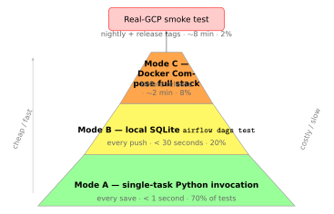

# Cloud Composer Costs $300+ a Month. Here's When to Use It — and How to Test Airflow Locally for Free.

### Composer is a managed Airflow, and it's expensive. Here's the honest cost breakdown and how to skip it safely.



---

Let me tell you about the most expensive line item in most GCP data pipelines.

It's not BigQuery. It's not Dataflow. It's not even Cloud Storage over a few terabytes.

It's **Cloud Composer** — Google's managed Apache Airflow.

A minimal Composer 2 environment in 2026 runs you roughly **$300 a month** before you've scheduled a single task. That's a GKE cluster, a Postgres metadata DB, a scheduler, a webserver, and at least one worker — all running 24/7, whether your pipeline ran at 6am and finished at 7am or not.

For a team with three entities, a daily load, and no regulatory requirement that names Airflow specifically, Composer is **overkill**.

Here's how to think about whether you actually need it, what to use instead, and how to test Airflow locally so you don't pay a penny while developing.

---

## When Composer is worth it

- You already have Airflow DAGs in another system and you're migrating.
- You have more than about 30 DAGs and they genuinely need a scheduler.
- You have cross-team DAGs that need centralised visibility.
- Your compliance framework explicitly names Airflow.
- You need to use the Airflow provider ecosystem (500+ operators).
- You have SLA requirements that benefit from Airflow's SLA miss tracking.

If any of those apply, Composer is genuinely the right answer. Pay the $300 and move on.

---

## When Composer isn't worth it

- You have a handful of DAGs, each running once a day.
- Your triggers are event-driven (GCS notifications → Pub/Sub → run).
- Your pipelines are mostly sequential; there's little real DAG complexity.
- You're a small team and $300/month is real money.

In those cases, the `gcp-pipeline-framework` treats Composer as **opt-in**. The Terraform module exists; the default deploy doesn't provision it. You save $300.

---

## What you replace it with

The framework supports three lighter alternatives:

**Cloud Functions for Pub/Sub triggers.**
Replace the `pubsub_trigger` DAG with a 50-line Cloud Function. One second of execution per file. Costs cents per day, not dollars. Same idempotence patterns; same dead-letter routing.

**Cloud Run Jobs for scheduled runs.**
Run a `dbt run` or a Dataflow Flex Template launch as a Cloud Run Job, triggered by Cloud Scheduler. Spins up, does the work, spins down. Pay for the execution time, not the uptime.

**Workflows for sequencing.**
If you need DAG-like semantics without Airflow — sequential tasks, branching, retries — Google Workflows covers most of what you need. Not as flexible as Airflow; cheaper and simpler.

A pipeline built this way runs the `generic` reference system for about **$185/month** instead of $485. Same functionality, $3,600/year saved.

---

## How to decide

Ask one question: **do I really use Airflow's advanced features?**

If you're using:
- `TriggerDagRunOperator` for cross-DAG orchestration.
- XCom for substantial data passing.
- Pool-based concurrency control.
- `ExternalTaskSensor` for cross-DAG dependencies.
- Complex branching with `BranchPythonOperator`.
- SLA misses triggering escalations.

Then you probably want Composer. Pay the $300.

If you're using:
- Sequential tasks.
- One or two pool slots.
- No cross-DAG coordination.
- A handful of retries.

Then you don't need Composer. Use the cheaper substitutes. Save the money.

---

## How to test Airflow locally (three modes)

The single biggest complaint I hear about developing for Airflow is: "How do I test it without Composer?"

You don't need Composer to test Airflow. You need Airflow running on your laptop. The framework supports three testing modes, in increasing order of investment.

### Mode A — Single-task Python invocation

The fastest way to exercise a task. No Airflow server, no scheduler, no database.

```python
from airflow.utils.context import Context
from airflow.models import DagBag

def test_ingestion_launch_task():
    bag = DagBag(dag_folder="deployments/data-pipeline-orchestrator/dags",
                 include_examples=False)
    dag = bag.get_dag("ingestion_customers")
    task = dag.get_task("run_dataflow")

    ctx = Context(
        dag=dag, task=task,
        run_id="manual__2026-04-17T09:00:00+00:00",
        ds="2026-04-17",
        dag_run=None,
        params={"input_file": "gs://landing/customers.csv"},
    )
    task.execute(ctx)
```

Catches Jinja template typos, bad parameter rendering, anything that fails at task render time. Runs in CI under a second.

### Mode B — `airflow dags test` on local SQLite

Airflow ships with a `dags test` subcommand that runs a full DAG execution against a local SQLite database, in-process. No scheduler, no web server, no Docker. You get real execution, real XCom, real logs — single-threaded, non-scheduled.

```bash
# one-time setup
export AIRFLOW_HOME=$PWD/.airflow
pip install 'apache-airflow==2.8.*' \
    --constraint "https://raw.githubusercontent.com/apache/airflow/constraints-2.8.0/constraints-3.11.txt"
airflow db init
export AIRFLOW__CORE__DAGS_FOLDER=$PWD/deployments/data-pipeline-orchestrator/dags
export AIRFLOW__CORE__LOAD_EXAMPLES=False

# per run
airflow dags test ingestion_customers 2026-04-17
```

Tasks that touch real GCP would fail here, so point them at the framework's fakes — `FakeGCSClient`, `FakeBigQueryClient`, `FakePubSubClient` — via an environment variable. A `make test-dag DAG=ingestion_customers` target wraps it into one command.

### Mode C — Docker Compose with the full stack

For DAGs where scheduler and executor behaviour actually matters (pool contention, SLA tests, concurrency), the framework ships a Docker Compose file at `scripts/airflow-local/docker-compose.yml`. It spins up:

- Postgres (metadata DB).
- Airflow webserver (at http://localhost:8080, admin/admin).
- Airflow scheduler (LocalExecutor).
- Fake GCS server (`fsouza/fake-gcs-server`).
- Pub/Sub emulator (`gcloud beta emulators pubsub`).
- BigQuery emulator (`goccy/bigquery-emulator`).

One command to start:

```bash
scripts/airflow-local/up.sh
```

The framework's GCP clients detect emulator environment variables and switch backends automatically. No DAG-side code changes needed. Your DAGs actually run, trigger downstream DAGs, write rows, publish messages — without touching a real GCP project.

Total cost: the electricity to run your laptop.

### The testing pyramid

- **~70% structural tests** (DAG imports, dependency graphs, retry policies). Fast, CI-friendly.
- **~20% single-task executions** (Mode A). Catch Jinja, parameter, template issues.
- **~8% local full-DAG runs** (Mode B / Mode C). Catch integration issues.
- **~2% real-GCP smoke tests.** Catch the things only real services can break.

Run structural + single-task on every PR. Run full local stack on merge to main. Run real-GCP smoke on tag.

### What local testing catches that CI doesn't

Real bugs I've caught locally that structural tests missed:

- **Jinja template typos** that only render at task-execution time.
- **XCom payload size limits** — Airflow silently truncates XComs above a threshold.
- **Pool and concurrency deadlocks.**
- **Sensor backpressure** — pull sensors behave differently against a queued topic.
- **Cross-DAG triggers** — `TriggerDagRunOperator` only really works with a scheduler.
- **Import-time side effects** in DAG factories.

If you take one thing from this post: **wire up Mode B on day one**. Twenty minutes of setup. Catches three classes of bugs you'd otherwise find in production.

---

## My honest recommendation

For most teams starting a new pipeline on GCP in 2026:

1. **Build without Composer first.** Cloud Functions + Cloud Run Jobs + Cloud Scheduler. $50/month.
2. **Test locally with Mode B every day.** Mode C once a week.
3. **If you outgrow the substitutes** (more than ~30 DAGs, real cross-DAG coordination, SLA miss escalation), migrate to Composer. The framework's orchestration deployment deploys either way.
4. **Never put Composer in the critical path of a product launch** without running a cost forecast first.

The framework is built to make both paths equally easy. The Terraform module has a single `deploy_composer` flag. The DAG factory generates the same DAGs either way. Switch it on when you need it; leave it off when you don't.

---

## Try it

```bash
pip install gcp-pipeline-framework
python -m gcp_pipeline_framework.reconstruct --dest ~/my-pipeline
cd ~/my-pipeline
cat infrastructure/terraform/systems/generic/orchestration/main.tf  # Composer is opt-in
bash scripts/airflow-local/up.sh                                    # local stack in 60 seconds
```

---

## What's next

Final post in the series: **Shipping a Python data framework to PyPI — lessons from gcp-pipeline-framework.** How I published six packages, the `reconstruct.py` trick, and why I'd do it again.

---

*Running without Composer? Saved money with Cloud Run Jobs? Got burned by "Airflow will save us"? Stories in the comments.*

---

### About the author

**Joseph Aruja** — Lead Software Engineer based in Leeds, UK. Twenty-five years across banking, government, retail, transport, healthcare, and travel — including NHS Spine (technical lead, Release 7A), HSBC / First Direct / M&S Bank, GOV.UK / Home Office / DWP, Jaguar Land Rover, Booking.com, Smart Ticketing on Manchester Metrolink, and Wm Morrison's Evolve mainframe-integration programme. Member of the JSR 255 (JMX) Java Community Process specification group. Currently Senior Lead Engineer on a financial-services mainframe-to-cloud migration.

Connect on [LinkedIn](https://www.linkedin.com/in/josepharuja/) · email joseph.a.aruja@gmail.com

**Want the long form?** This series is part of a book — *Building Production-Grade Data Pipelines on Google Cloud* — available at [link — add before publishing]. **If this post was useful, a clap helps more than you'd think, and follow for the next instalment.**
