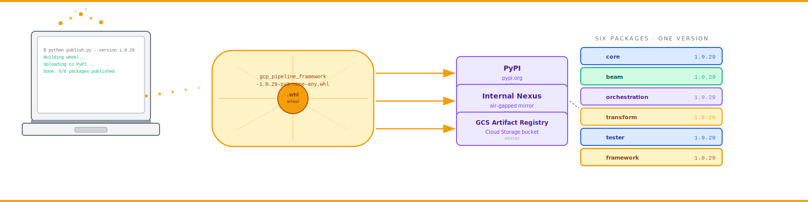

# Shipping a Python Data Framework to PyPI: Lessons from gcp-pipeline-framework

### Why I published six packages, what `reconstruct.py` does, and why you should publish your Terraform too.



---

When I started building `gcp-pipeline-framework`, the question of how to ship it was almost an afterthought. I figured: build the libraries, push to GitHub, write a README, done.

Two months in, that strategy fell apart.

A team in a regulated bank wanted to adopt the framework. Their VPC couldn't reach GitHub. They needed it on their internal Nexus, with a deterministic version, with all the docs and Terraform and CI configs included. "Just clone the repo" wasn't an option.

So I redesigned the distribution model. The result is one of the things I'm proudest of in the framework — and also one of the most unusual choices, so let me walk you through it.

---

## Six packages, one version

The framework lives on PyPI as six packages:

| Package | Role |
|---|---|
| `gcp-pipeline-core` | Foundation — audit, monitoring, FinOps, errors, schema |
| `gcp-pipeline-beam` | Beam transforms and pipeline builder |
| `gcp-pipeline-orchestration` | Airflow operators, sensors, factories |
| `gcp-pipeline-transform` | dbt macros |
| `gcp-pipeline-tester` | Test base classes, mocks, fixtures |
| `gcp-pipeline-framework` | Umbrella; pulls in all of the above plus reference deployments |

All six are versioned together. The single source of truth is the top-level `VERSION` file. CI reads it during packaging and refuses to publish a tag whose version doesn't match.

The umbrella package, `gcp-pipeline-framework`, is the recommended install. New team runs `pip install gcp-pipeline-framework` and gets everything in one step.

**Why synchronised versioning, not independent semver?** Because the libraries are deeply intertwined. A change in `core` often needs corresponding changes in `beam` and `orchestration`. Independent semver invites version-skew bugs that are *miserable* to debug. The trade-off is that a tiny change in `core` triggers a version bump everywhere; I'd rather pay that cost than chase compatibility matrices.

---

## The `reconstruct.py` trick

This is the cleverest piece of the distribution story.

`reconstruct.py` is a small script that, given an optional version and an optional PyPI index URL, does this:

1. Creates a temporary virtualenv.
2. Runs `pip install gcp-pipeline-framework==<version>` against the chosen index.
3. Walks the installed package tree.
4. Copies the embedded `docs/`, `infrastructure/`, `scripts/`, `templates/`, and `dags/` folders out of the wheel into a destination directory.
5. Writes a `README.md` and `VERSION` at the destination root.

The result: a fresh, ready-to-use copy of the entire reference repository, **regenerated from PyPI**. No GitHub access required. No source repository required. Just `pip` and a Python interpreter.

```bash
# From public PyPI
python reconstruct.py

# Specific version
python reconstruct.py --version 1.0.29

# From a private mirror
python reconstruct.py --index-url https://nexus.internal/repository/pypi/simple/

# Custom destination
python reconstruct.py --dest /path/to/my-pipeline-project
```

**Why this matters.** Two big reasons:

1. **Restricted networks.** Many large enterprises lock down outbound to GitHub but allow PyPI mirrors. `reconstruct.py --index-url=https://nexus.internal/...` works there.
2. **Versioned environments.** `reconstruct.py --version 1.0.27` produces exactly the layout that was current at version 1.0.27, regardless of subsequent changes. Invaluable for incident replay and reproducing customer environments.

---

## How embedding works

The mechanism: `pyproject.toml`'s `package_data` configuration:

```toml
[tool.setuptools.package_data]
"gcp_pipeline_framework" = [
    "embedded/**/*",
]
```

Plus a CI step that copies the relevant directories into `embedded/` before the wheel build:

```yaml
- name: Embed project assets
  run: |
    mkdir -p src/gcp_pipeline_framework/embedded
    rsync -a docs/         src/gcp_pipeline_framework/embedded/docs/
    rsync -a infrastructure/ src/gcp_pipeline_framework/embedded/infrastructure/
    rsync -a scripts/      src/gcp_pipeline_framework/embedded/scripts/
    rsync -a templates/    src/gcp_pipeline_framework/embedded/templates/
```

The wheel is self-contained. `reconstruct.py` knows where to look because the layout is fixed by convention.

---

## The CI workflow that ties it together

Eight workflows in `.github/workflows/`, but the publishing-relevant ones are:

- **`test.yml`** — runs every library's test suite on PRs.
- **`publish-libraries.yml`** — builds and publishes libraries to PyPI on tags.
- **`publish-deployments.yml`** — builds and publishes reference deployments to PyPI on tags.

The release flow:

1. Bump `VERSION`.
2. Update `CHANGELOG.md`.
3. Open a PR; pass CI; merge.
4. Tag the merge commit with `v<version>`.
5. Publish workflows fire on the tag and push to PyPI.

Importantly: **publishing and deploying are separate workflows.** A library publish creates a versioned PyPI artefact. A deployment runs Terraform and pushes a Dataflow template. Mixing them invites race conditions where a deploy uses a published version that hasn't propagated through PyPI's CDN yet.

---

## Workload Identity Federation, not JSON keys

CI authenticates to PyPI with an API token (stored as a GitHub secret), and to GCP with **Workload Identity Federation** — no long-lived JSON keys.

```yaml
- uses: google-github-actions/auth@v2
  with:
    workload_identity_provider: projects/.../locations/global/workloadIdentityPools/github-pool/providers/github
    service_account: pipeline-deployer@<project>.iam.gserviceaccount.com
```

Long-lived JSON keys are the leading cause of leaked credentials in pipeline projects. WIF eliminates them entirely.

---

## Lessons learned

If you're about to ship a Python framework, here's what I wish I'd known:

**1. Synchronised versioning is unfashionable but right.**
For a tightly-coupled framework, the alternative is a compatibility matrix you'll never keep up to date. Synchronised versioning means a fresh `pip install` always gets a coherent set.

**2. Embed your non-Python assets.**
Docs, Terraform, CI configs, scripts. Embedding them in the wheel costs almost nothing and unlocks the "rebuild from package" pattern. It also means your docs are versioned with the code that produced them.

**3. Path-filter your CI.**
A docs change shouldn't redeploy production. A library change should trigger tests but not deploys. GitHub Actions' `paths:` filter is the cleanest way I've found to do this.

**4. Publish before you deploy.**
A deployment that pulls from PyPI must wait for the PyPI CDN to update. Race conditions here are nasty. Decoupling publish and deploy into separate workflows fixes this and gives you the choice of cherry-picking versions for environments.

**5. Make `reconstruct.py` (or its equivalent) part of day-one.**
Even if you're the only consumer today. The first time someone asks "how do I get this into our internal Artifactory" you'll be glad you did.

**6. Workload Identity Federation, immediately.**
If you're still using JSON service-account keys in CI in 2026, fix that this week.

**7. No coverage gate.**
Tempting, but it pushes tests towards padding the number rather than catching bugs. We report coverage; we don't gate on it. We *do* gate on test pass.

---

## What I'd do differently

Three things, honestly:

**A canary deploy pattern.** Right now a new Dataflow image goes straight to prod. A canary (run new image against a subset of an entity for a few hours, then promote) would catch the bugs unit tests can't.

**A working streaming reference.** The `postgres-cdc-streaming` deployment is a skeleton. I'd love a fully production-grade streaming pipeline shipped with the framework.

**An admin UI for quarantine review.** Right now it's Slack notifications + SQL queries. A small Streamlit app would dramatically improve operability.

All on the v2 list.

---

## Try it

```bash
pip install gcp-pipeline-framework
python -m gcp_pipeline_framework.reconstruct --dest ~/my-pipeline
cd ~/my-pipeline
ls
# docs  infrastructure  scripts  templates  dags  README.md  VERSION
```

That's the trick. Pure pip. Full project layout.

---

## And that's the series

Eight posts. The whole framework, top to bottom:

1. I Built a Full GCP Data Pipeline Framework — overview.
2. The GCP Pipeline Gap — why the ecosystem needs this.
3. GCP Pipelines, Zero to Hero — the basics.
4. The Three-Unit Deployment Model — the core architecture.
5. Mainframe to BigQuery — HDR/TRL parsing with Beam.
6. JOIN vs MAP — the two transformation patterns.
7. When to skip Cloud Composer + local Airflow testing.
8. Shipping to PyPI — this post.

If you've read all eight, thank you. Genuinely. That's a few hours of your time and I'm grateful.

The full book version (with chapters I didn't break out into posts: observability and FinOps in depth, Terraform module design, the testing strategy, an honest code review, a cost model, a glossary, and a roadmap) is at [link — add before publishing].

The code is on PyPI. The reference project is on GitHub. The framework is yours to use, fork, criticise, and improve.

If it helps you ship a pipeline you can stake your career on — that's the win I built it for.

— *Joseph*

---

*Want the next series? I'm thinking about a follow-up on real-time CDC patterns. Drop a comment if that's something you'd read.*

---

### About the author

**Joseph Aruja** — Lead Software Engineer based in Leeds, UK. Twenty-five years across banking, government, retail, transport, healthcare, and travel — including NHS Spine (technical lead, Release 7A), HSBC / First Direct / M&S Bank, GOV.UK / Home Office / DWP, Jaguar Land Rover, Booking.com, Smart Ticketing on Manchester Metrolink, and Wm Morrison's Evolve mainframe-integration programme. Member of the JSR 255 (JMX) Java Community Process specification group. Currently Senior Lead Engineer on a financial-services mainframe-to-cloud migration.

Connect on [LinkedIn](https://www.linkedin.com/in/josepharuja/) · email joseph.a.aruja@gmail.com

**Want the long form?** This series is part of a book — *Building Production-Grade Data Pipelines on Google Cloud* — available at [link — add before publishing]. **If this post was useful, a clap helps more than you'd think, and follow for the next instalment.**
